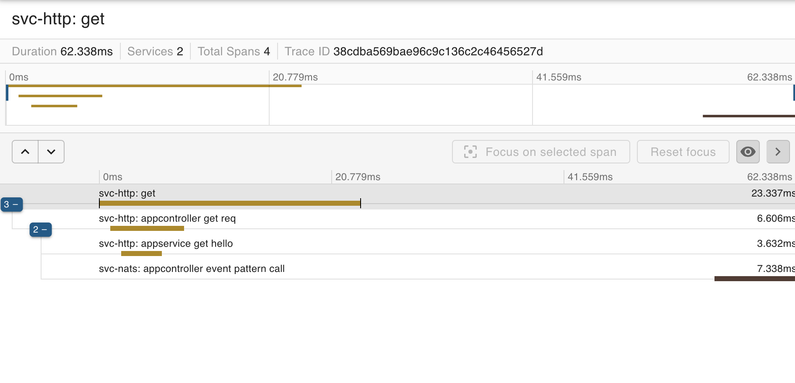

# Distributed Tracing with OpenTelemetry

This example utilizes the following components:

- **Elastic**.
- **Zipkin**.
- **OpenTelemetry Collector**.
- **svc-http**: A service that uses HTTP for interaction and makes calls to the NATS service.
- **svc-nats**: A service that uses NATS for message exchange.

## Deployment with Docker Compose

### Installation Steps

1. Start the containers:

   ```bash
   docker-compose up --build -d

   ```

2. svc-http endpoint call

```bash
    curl http://localhost:3000
```

3. Tracing check: http://localhost:9411/zipkin/
   

## NestJS Tracing Module Structure

This section outlines the structure of the NestJS tracing module, which is responsible for implementing tracing functionality using OpenTelemetry.

```bash
tracing
├── propagator
│   ├── propagator.interface.ts
│   ├── propagator.provider.ts
│   └── propagator.service.ts
├── tracer
│   ├── tracer.interface.ts
│   └── tracer.service.ts
├── tracing.constants.ts
├── tracing.module.ts
└── tracing.provider.ts
```

### Component Descriptions

- **propagator**: This directory contains components responsible for propagating tracing information across service boundaries.

  - `propagator.interface.ts`: Defines the interface for the propagator functionality.
  - `propagator.provider.ts`: Provides OTEL combined propagator.
  - `propagator.service.ts`: Implements the propagation logic for tracing.

- **tracer**: This directory includes components related to the tracer functionality.

  - `tracer.interface.ts`: Defines the interface for the tracer functionality.
  - `tracer.service.ts`: Implements the logic for tracing operations.

- **tracing.constants.ts**: Contains constants used throughout the tracing module.

- **tracing.module.ts**: Runs & Stops OTEL SDK. Defines the NestJS module for the tracing functionality, consolidating the various components.

- **tracing.provider.ts**: Provides OTEL SDK for the tracing module.
